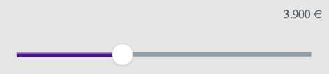

# AmountSlider

This project showcases an example of how to build a *Reusable
Component* that allows you to select a cash amount of a specific currency by
moving a slider. It uses `Intl.NumberFormat` to format the amount in the
currently selected locale and add the currency symbol or
[ISO 4217](https://en.wikipedia.org/wiki/ISO_4217) code for the selected currency.

The Visualizer project just serves as a wrapper to demo the
component. The component -called `com.mig82.AmountSlider` is the real focus
of this exercise.

## Implementation Notes

This project was built using Kony Visualizer 8.4.22.

## Use Cases

Use it to allow a user to pic amounts to be transferred, paid or borrowed.

## Naming Conventions

I favour suffixes in lieu of prefixes. All widgets and skins in this component bear names with suffixes indicating what they are —e.g.: `amountLabel`.

Skins bear the suffix of the widget type they apply to, followed by the `Skin` suffix —e.g.: `AmountSliderFooFlexSkin`.
